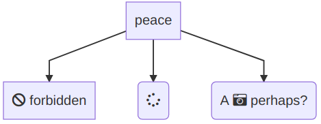
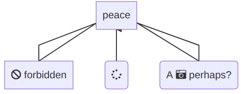
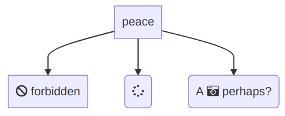
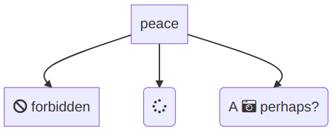
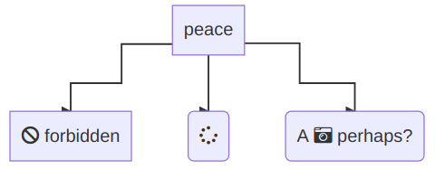
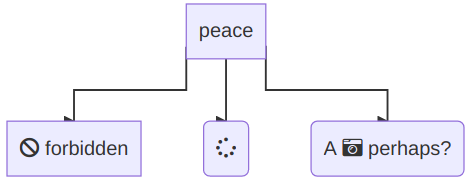
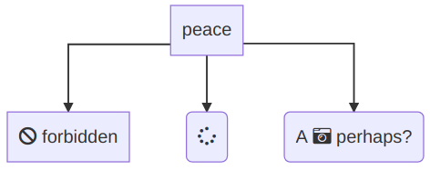

# MermaidJS Default Curves

In this article I will share a list of curves that you can interpolate
to the MermaidJS flowchart link style and a screenshot and description
for each one.

## What is MermaidJS?

[MermaidJS](https://github.com/mermaid-js/mermaid/tree/develop) is a markdownish
language allowing you to write diagrams. It is built in JavaScript and the code
is parsed using [Jison](https://github.com/zaach/jison).

## What is interpolation in flowcharts?

Interpolation is a feature added in 6.0.0 that allows you to specify how curves
should be made inside flowcharts. The syntax is like:

```text
linkStyle default|[...num] interpolate curveStyle [styles]
```

The num represents all numbers or indexes of arrows to style.
The interpolate represents that their curve style has to be changed.
After that, comes the curve style and following that comes CSS styles.

The following would add the d3 curveMonotoneX on all arrows that are curving.

```text
graph TD
    B["peace"]
    B-->C[fa:fa-ban forbidden]
    B-->D(fa:fa-spinner);
    B-->E(A fa:fa-camera-retro perhaps?);
    linkStyle default interpolate monotoneX
```

It would look something like:


Writing `monotoneX` and `MonotoneX` would both be valid because internally, MermaidJS
updates the curve interpolation type to its capatilized version and precedes it
with `"curve"` and finds the d3 curve type for that.

## What are the possible interpolations?

- Basis

This curve is the default curve used by MermaidJS. It has some sort of line then
it curves near the end. Here is an example:


- Linear

This is the fallback curve used by MermaidJS that runs when the given interpolation
is invalid. It doesn't involve any curves, it just combines one or more lines to
reach the end node. Here is an example:



- Basis Closed

This is a pretty rarely used curve. It just draws an ellipse or loop with a triangle
arrowhead at some point on it. Here is an example:


- Basis Open

- Linear Closed

The linear closed curve draws a triangle pointing towards the node.
Here is how it looks:



- Monotone X

This curve is just a curve then another straighter curve. It looks like this:


- Monotone Y

The Monotone Y curve is a line, a curve at the turning point, then a line.
It looks something like this:



- Natural

The natural curve is a pure curve and it sort of slides out and then comes back in.
Here is an example of how it looks:



- Step

The step curve is formed of linear lines that make their way to the end node.
The lines are either vertical or horizontal and aren't diagonal. It sort of forms
a stairsteps. Here is how it looks:



- Step Before

The step before curve starts with a line going straight
down (straight out in horizontal charts) instead of outwards.



- Step After

The step after curve goes out first and tries to do a minimal amount of steps.
Also, the arrowhead is facing the right direction in it.


